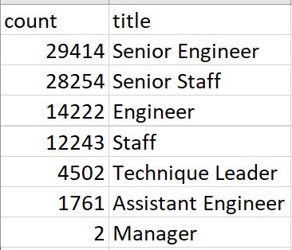

# Pewlett-Hackard-Analysis

## Overview of the Analysis
This project is to help Human Resource Department at Pewlett Hackard identify the employees who are about to retire. It also lists employees who are eligible to participate in the mentorship program, so that once some high-level employees retire, there are trained-ready employees available to fulfill the vacant rolls. 

## Results
Based on the number of retiring employees and the number of employees who are eligible to participate in the mentorship program, we can get the main results as below:

- There is a total of 90,398 employees about to retire, however, only 1549 employees are eligible for the mentorship program, indicating the need for external hiring;
- More than half of the retiring employees are currently working on senior positions. Therefore, the external hiring should focus on more experienced candidates;
- Among the 1549 employees that are eligible for the mentorship program, 1175 of them are at a senior position or a leader position;
- There are only two managers who are retiring, indicating the company have a stable and younger management team.

## Summary

**How many roles will need to be filled as the "silver tsunami" begins to make an impact?**
 

There are 90398 positions to be fulfilled. We can create a retiring employee table based on departments to identify which department needs more hiring from outside. Also, we can include the total number of employees in each department to identify the age population in different departments;

**Are there enough qualified, retirement-ready employees in the departments to mentor the next generation of Pewlett Hackard employees?**
 

Judging by the number of the eligible employees, there is not enough retiring employees to mentor the next generation. However, we can create another query to show eligible employees based on departments so that we can further clarify on which department is specifically short of eligible employees for training. For some positions, it may not need to be one-on-one mentorship but rather next generation employees can be mentored as a group, whereas for other positions such as manager, it needs to be one-on-one mentorship. 

In addition, we can also create a query on the average promotion time to become a Senior Engineer and a Senior Staff, so that we can identify which engineer or staff is almost ready for a promotion and these employees can become the key mentees in the mentorship program. 
